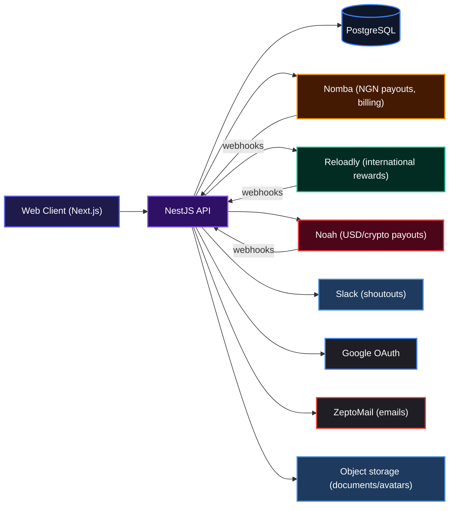
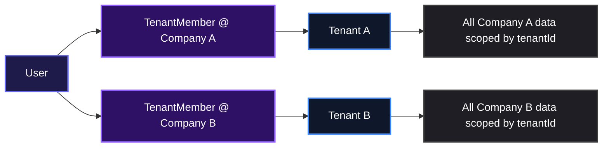
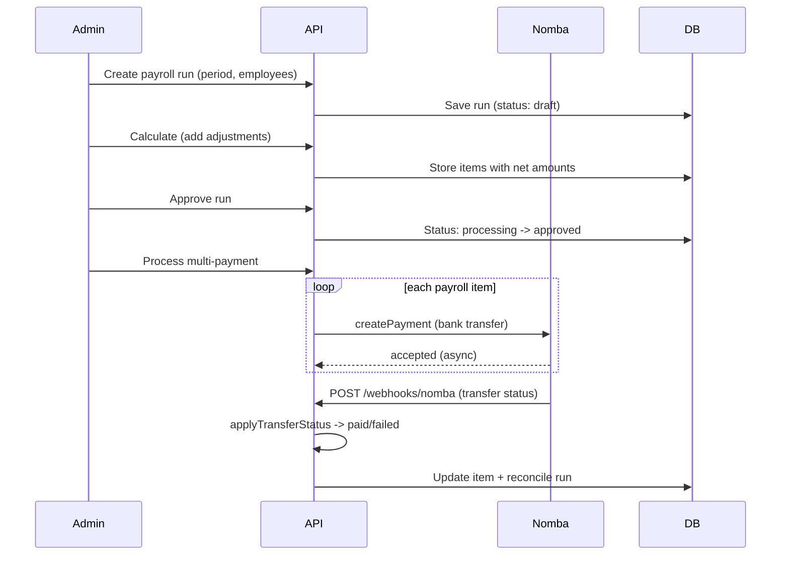
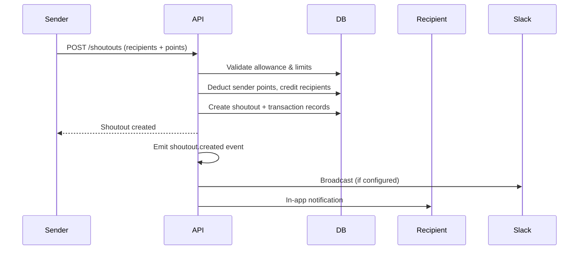
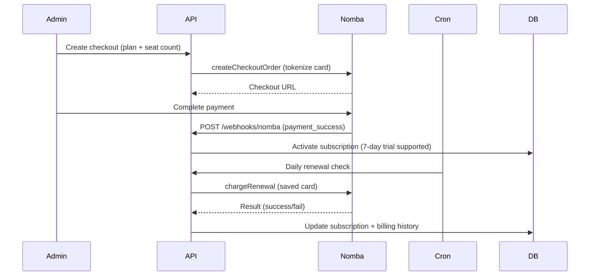

# PaqadHR

PaqadHR is an all-in-one HR platform for growing companies. One workspace to manage people, pay, time off, hiring, and recognition. Instead of juggling spreadsheets, chat threads, and separate tools, you get a single place where everything lives — payroll, leave, attendance, recruitment, peer recognition, and more.

## Documentation
* **Product docs**: [https://hackmd.io/@mbazudaniel/paqadhr](https://hackmd.io/@mbazudaniel/paqadhr)
* **Architecture**: [https://hackmd.io/@mbazudaniel/paqadhr-architecture](https://hackmd.io/@mbazudaniel/paqadhr-architecture)
* **AI agents start here**: [AGENTS.md](./AGENTS.md)
* **Security mandate (mandatory)**: [SECURITY.md](./SECURITY.md)
* **Performance rules (mandatory)**: [PERFORMANCE.md](./PERFORMANCE.md)

**Live demo**: [https://dev.paqadhr.com](https://dev.paqadhr.com)  

Try the rewards flow: log in, go to Shoutouts, check your points balance, and claim an airtime reward.

---

## System Architecture



The platform is built as a `pnpm` monorepo with two applications:

- **`apps/api`**: NestJS backend (TypeScript, PostgreSQL, TypeORM)
- **`apps/web`**: Next.js frontend (React, TanStack Query)

All money flows (payroll, subscriptions, rewards) are asynchronous: the API starts a payment, a webhook confirms it, and cron jobs reconcile stuck transactions.

---

## Features

### Multi-tenant workspaces

Each company gets a secure, isolated workspace. One login can belong to many workspaces. Data is scoped by `tenantId` and access is enforced at the guard layer.



### Payroll processing with manual and gateway disbursement

Create payroll runs, calculate salaries, approve, and pay out. Supports manual disbursement (mark as paid offline) and gateway disbursement through Nomba (NGN) or Noah (USD/crypto). Webhooks update payment status automatically.



### Peer shoutouts and Paq Points

Send recognition to colleagues with a message and core-value category. Points are debited from the sender's monthly allowance and credited to each recipient's balance. Recipients can spend points on rewards (airtime, gift cards, custom perks).



### Subscription billing (per-seat pricing)

Workspaces subscribe to plans with per-user pricing. Billing flows through Nomba (tokenized card). Renewals are charged via a daily cron, with dunning retries and a grace period before suspension.



---

## Technologies Used

| Technology | Description |
|------------|-------------|
| [NestJS](https://nestjs.com/) | Backend framework (Node.js) |
| [TypeScript](https://www.typescriptlang.org/) | Language |
| [PostgreSQL](https://www.postgresql.org/) | Database |
| [TypeORM](https://typeorm.io/) | ORM |
| [Next.js](https://nextjs.org/) | Frontend framework |
| [React](https://reactjs.org/) | UI library |
| [TanStack Query](https://tanstack.com/query) | Data fetching |
| [pnpm](https://pnpm.io/) | Package manager |
| [Turbo](https://turbo.build/) | Monorepo orchestration |
| [Biome](https://biomejs.dev/) | Linting and formatting |
| [ZeptoMail](https://www.zoho.com/zeptomail/) | Email delivery |
| [Nomba](https://nomba.com/) | NGN payments and billing |
| [Reloadly](https://www.reloadly.com/) | International gift cards and top-ups |
| [Noah](https://noah.com/) | USD/crypto payouts |

---

## Quick Start

Clone the repository and set up the development environment:

```bash
git clone https://github.com/OktopalsHub/PaqadHR.git
cd PaqadHR
pnpm install
```

Copy environment template files:

```bash
cp apps/api/.env.example apps/api/.env
cp apps/web/.env.example apps/web/.env
```

Configure your PostgreSQL connection and other secrets in `apps/api/.env` (and web vars in `apps/web/.env`). Variable descriptions live in `apps/api/.env.local.example` and `apps/web/.env.local.example`. Then start both apps:

```bash
pnpm dev
```

- API runs on `http://localhost:9001`
- Web runs on `http://localhost:3000`

For full setup instructions, see the [apps/api/README.md](https://github.com/OktopalsHub/PaqadHR/blob/main/apps/api/README.md).

---

## Author

**Daniel Mbazu**  
Backend Engineer & Lead Developer  
[GitHub](https://github.com/mbazu-daniel)  
Email: mbazudaniel97@gmail.com

---

## Badges

[](https://nestjs.com/)
[](https://www.typescriptlang.org/)
[](https://www.postgresql.org/)
[](https://nextjs.org/)
[](https://reactjs.org/)
[](https://pnpm.io/)
[](https://turbo.build/)

[](https://dokugen.samueltuoyo.com)